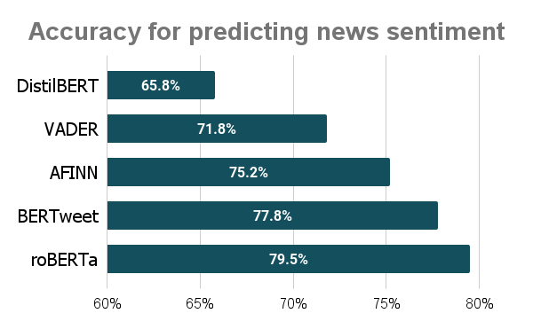

# News Positivity Research

## Introduction

It's common knowledge that there's a negativity bias in news which is affecting our mental health. The purpose of this project is to help tackle the problem by finding a good way to measure the negativity in news content. I use Jupyter to assess the performance of several sentiment analysis models in this context.

## Table of contents
- [News Positivity Research](#news-positivity-research)
  - [Introduction](#introduction)
  - [Table of contents](#table-of-contents)
  - [Methodology](#methodology)
    - [Sourcing the test set](#sourcing-the-test-set)
    - [Picking the models](#picking-the-models)
  - [Results & discussion](#results--discussion)

## Methodology

### Sourcing the test set

The [test.csv](./test.csv) file contains a dataset of headlines I gathered from 3 news sites:
- [positive.news](https://positive.news)
- [bbc.co.uk](https://bbc.co.uk)
- [thecanary.co](https://thecanary.co)

For each headline, I manually assigned a sentiment score of -1 if it was negative, and +1 if it was neutral or positive. I felt it was appropriate to group together the neutral and positive content given that the main objective of this project was to calculate the negativity bias.

I chose those three sites because their content covers the full sentiment spectrum. The Canary and positive.news have clear remits to focus on negative and positive content, respectively, while the BBC is neutral. 

The [data notebook](./data.ipynb) has the scripts I used to scrape the headlines. They're designed to work only on the landing pages (e.g. https://bbc.co.uk) and not the article pages (e.g. https://www.bbc.co.uk/news/uk-england-birmingham-58282348). 

### Picking the models

I picked five pre-trained models:
- [AFINN](https://github.com/fnielsen/afinn)
- [VADER](https://github.com/cjhutto/vaderSentiment)
- [DistilBERT](https://huggingface.co/distilbert-base-uncased-finetuned-sst-2-english)
- [roBERTa](https://huggingface.co/cardiffnlp/twitter-roberta-base-sentiment)
- [BERTweet](https://huggingface.co/cardiffnlp/bertweet-base-sentiment)

AFINN and VADER are two popular dictionary-based models. DistilBERT is the default sentiment analysis model offered by Hugging Face in their [quick tour](https://huggingface.co/transformers/quicktour.html). Finally, roBERTa and BERTweet are two of the best performing models in the [TweetEval benchmark study](https://arxiv.org/pdf/2010.12421.pdf).

The [model notebook](./model.ipynb) runs each of these models on the test set and compares their performance.

## Results & discussion

I was surprised to see how DistilBERT, a state-of-the-art model, performed considerably worse than AFINN and VADER, both of which are older and simpler. One potential explanation is that the text content on which DistilBERT was trained (phrases in movie reviews) is inherently different than what's encountered in news headlines. 

BERTweet and roBERTa were the best-performers. However, I'm not convinced it's worth deploying them given they only improve the accuracy by 2.6% and 4.3%, respectively, compared to AFINN. They are huge models (500+ MB each) and require heavy processing power to generate a single score.

The clear winner is AFINN. Its accuracy might not look amazing at first, but you have to bear in mind that humans only agree 80% of the time on the sentiment of a piece of text. Therefore, a score of 75.2% means that the model does nearly as well as humans.